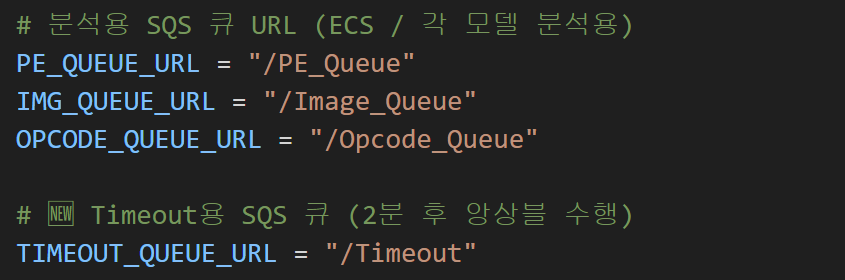
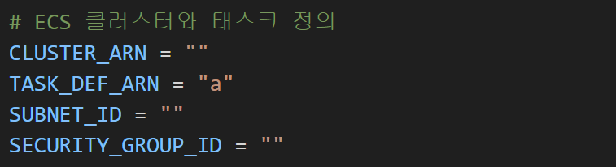

# Lambda_Function

이 디렉터리는 **Fit-Bool AI Malware Analysis Pipeline**의 핵심 **AWS Lambda 코드 모음**입니다.  
S3 업로드부터 SQS 이벤트, ECS 호출, AI 모델 실행, LLM 보고서 생성까지  
전체 서버리스 파이프라인의 자동화를 담당합니다.

---

## Directory Structure

Lambda_Function/
├── Dispatcher_Lambda/ # 업로드된 파일을 분석 큐(SQS)로 분배하는 진입점
├── Final_Ensemble_Lambda/ # PE/IMG/OPC 결과를 통합하여 최종 예측 수행
├── Final_LLM_Lambda/ # Bedrock Claude 모델을 통해 자연어 보안 리포트 생성
├── OPC_Lambda_1/ # ECS(Ghidra) 기반 Opcode 분석 Lambda
├── Timeout_Lambda/ # 장시간 실행 시 타임아웃 제어 (ECS/Queue 복구용)
├── URL_Lambda/ # 웹 요청(API Gateway ↔ Lambda) 핸들링 및 S3 업로드 관리
└── README.md # 폴더 설명 및 구성 요약

---

## Overview of Each Function

| Lambda | 역할 | 주요 연계 서비스 |
|:--------|:------|:----------------|
| **Dispatcher_Lambda** | S3 업로드 이벤트 감지 후 파일 유형(PE/IMG/OPC)에 따라 SQS 큐로 분배 | S3, SQS |
| **OPC_Lambda_1** | ECS(Ghidra) 작업을 트리거하여 Opcode 분석 수행 | ECS, SQS |
| **Final_Ensemble_Lambda** | 각 모델(PE/IMG/OPC)의 결과를 취합해 통합 판단 | S3 |
| **Final_LLM_Lambda** | AWS Bedrock Claude Haiku 모델을 호출해 결과 요약 리포트 생성 | Bedrock, S3 |
| **Timeout_Lambda** | 지정된 시간 내 실행되지 않은 큐/태스크를 재시도 또는 복구 | SQS |
| **URL_Lambda** | HTML 페이지(index.html, result.html)에서의 요청을 받아 업로드 처리 | API Gateway, S3 |

---

## Execution Flow

1️. 사용자가 웹 페이지(`fit-bool-web`)에서 샘플 업로드  
2️. S3 → `Dispatcher_Lambda` 트리거  
3️. 파일 확장자 기반으로 `PE_Queue`, `IMG_Queue`, `OPC_Queue` 중 하나로 분배  
4️. 각 모델 Lambda가 SQS 이벤트를 받아 분석 수행  
5️. 분석 결과는 `AI_Result/PE`, `AI_Result/IMG`, `AI_Result/OPC` 경로에 저장  
6️. `Final_Ensemble_Lambda`가 결과를 통합  
7️. `Final_LLM_Lambda`가 Bedrock Claude를 호출해 자연어 보고서 생성  
8️. 결과는 `AI_Result/Final_Report/`에 저장 및 시각화 페이지로 반환

---

## 참고 사항

- **Dispatcher_Lambda**  
  → SQS Queue 엔드포인트 URL을 환경 변수로 지정하세요.  
  

- **OPC_Lambda_1**  
  → 클러스터 URL, 태스크 정의, 서브넷, 보안 그룹 정보를 설정해야 합니다.  
  

---