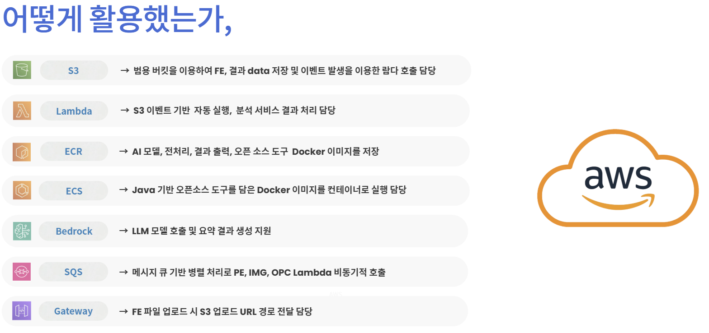
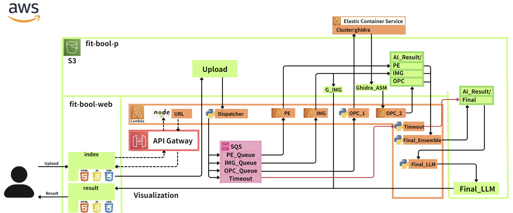
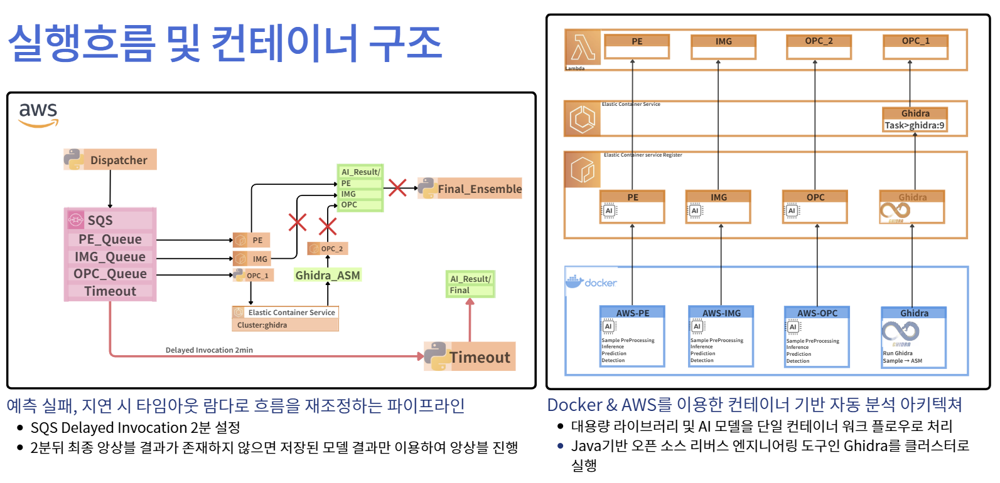
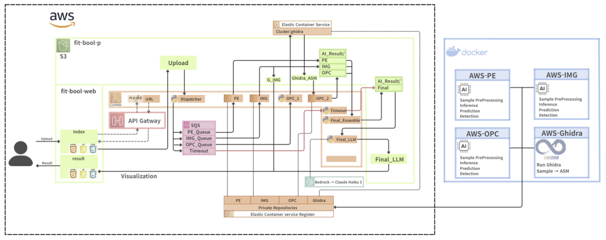

# Fit-Bool AI Malware Analysis System

## 📘 Overview
**Fit-Bool**은 AWS 기반 **AI 악성코드 분석 자동화 플랫폼**입니다.  
사용자가 업로드한 실행 파일을 자동으로 분류하고,  
PE, IMG, OPC, Ghidra 등 다양한 모델을 통해 다중 분석을 수행한 뒤  
최종적으로 LLM(Bedrock Claude 3 Haiku)을 이용해  
자연어 형태의 보안 보고서를 생성합니다.

이 저장소는 **Fit-Bool 시스템의 AWS 내부 구현 소스코드**를 포함하고 있습니다.  
즉, 실제 서비스 인프라에서 동작하는 Lambda 함수, ECS 컨테이너,  
S3 이벤트 트리거, Bedrock 연동 로직 등  
**AWS 상에서 동작하는 서버리스 및 컨테이너 아키텍처의 핵심 코드**를 모아둔 폴더 구조입니다.


Fit-Bool은 **Serverless + Container Hybrid Architecture** 구조로 설계되어  
Lambda, S3, ECS, SQS, Bedrock API 등을 통합하여  
대규모 병렬 AI 분석 환경을 구현합니다.

---
## Architecture




---

## Architecture Flow
```text
[Web Upload (fit-bool-web)]
      ↓
[S3: fit-bool-p] — file upload trigger
      ↓
[Dispatcher Lambda]
      ↓
[SQS Queues: PE / IMG / OPC]
      ↓
[Model Lambdas: PE_Lambda, IMG_Lambda, OPC_Lambda]
      ↓
[ECS Fargate → Docker_AI_for_ECS Containers]
      ↓
(Optional) [Docker_Ghidra_for_ECS — ASM Extraction]
      ↓
[Final_Ensemble_Lambda] — integrate model results
      ↓
[Final_LLM_Lambda] — generate report via Bedrock Claude 3 Haiku
      ↓
[S3: AI_Result/Final_Report] — store final JSON + report
      ↓
[CloudFront + S3 Website] — visualize results

```
---

## Directory Structure
```text
AWS/
├── Docker_AI_for_ECS/
│   ├── PE/                      # PE feature-based AI model container
│   ├── IMG/                     # Image-based CNN malware detector
│   ├── OPC/                     # Opcode sequence classifier
│   └── README.md
│
├── Docker_Ghidra_for_ECS/
│   ├── ghidra_11.4.2_PUBLIC/    # Headless Ghidra engine
│   ├── scripts/                 # Automation / analysis scripts
│   ├── Dockerfile               # ECS container build config
│   ├── lambda_function.py       # Lambda entry for task invoke
│   └── run_one.sh               # Ghidra headless execution
│
├── Lambda_Function/
│   ├── Dispatcher_Lambda/       # S3 trigger → SQS routing
│   ├── PE_Lambda/               # PE model analyzer
│   ├── IMG_Lambda/              # Image model analyzer
│   ├── OPC_Lambda/              # Opcode model analyzer
│   ├── Final_Ensemble_Lambda/   # Ensemble integration logic
│   ├── Final_LLM_Lambda/        # Bedrock LLM summary report
│   ├── Timeout_Lambda/          # Timeout control logic
│   └── URL_Lambda/              # API Gateway endpoint (index.mjs)
│
└── README.md                    # (this file) overall overview
```
---

## AWS Resource Map
| Category | Service | Purpose |
|-----------|----------|----------|
| **Storage** | S3 (`fit-bool-p`, `fit-bool-web`) | File upload & result storage |
| **Compute** | Lambda + ECS (Fargate) | Analysis & automation |
| **Queue** | SQS | Model fan-out and parallel processing |
| **AI/LLM** | Bedrock Claude 3 Haiku | Report generation |
| **API** | API Gateway | Upload / Result retrieval |
| **Visualization** | CloudFront + S3 Website | Result dashboard UI |

---

## ⚙️ Workflow Summary
1️. 사용자가 웹 페이지를 통해 파일을 업로드 (S3 저장)  
2️. `Dispatcher_Lambda`가 이벤트를 받아 확장자별로 SQS 전송  
3️. PE/IMG/OPC Lambda → ECS 컨테이너 실행 및 AI 분석  
4️. 결과를 `AI_Result/` 경로에 저장  
5️. `Final_Ensemble_Lambda`가 결과를 통합  
6️. `Final_LLM_Lambda`가 Bedrock API로 요약 리포트 생성  
7️. 최종 결과는 S3에 저장되고 웹에서 시각화됨  

---

## Future Improvements
- Ghidra ASM 결과 자동 통합 (Opcode pipeline)  
- EventBridge 재시도 정책 적용  
- ECS 오토스케일링 및 비용 최적화  

---

## Authors
**Fit-Bool AI Security Research Team**  
- Lead Engineer: [Lee DoHyup](https://github.com/LeeDoHyup)  
- Contributors: AI Malware Analysis Team 