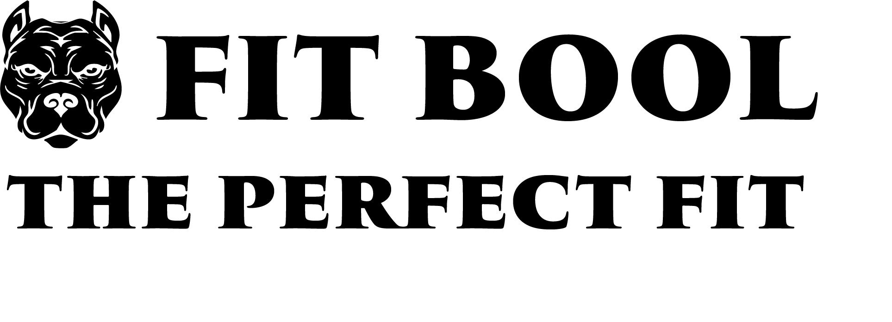
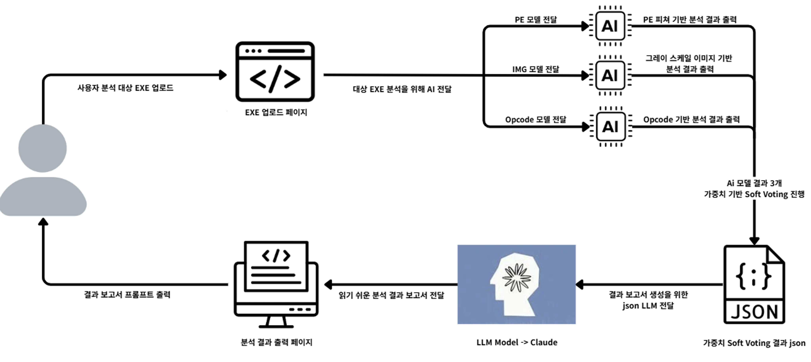

# Malware Detection with Multi-Model Integration
<br>
<p align="center">
  
</p>

### 📋 목차 (Table of Contents)
1.  [**프로젝트 개요**](#프로젝트-개요)
2.  [**개별 분석 모델 테스트 가이드**](#-개별-분석-모델-테스트-가이드)
    - [PE 구조 분석](#1-pe-구조-분석-static-analysis)
    - [이미지 분석](#2-이미지-분석-img-analysis)
    - [Opcode 분석](#3-opcode-분석-opcode-analysis)
3.  [**모델 앙상블 (Soft Voting)**](#모델-앙상블-soft-voting)
4.  [**프로젝트 구조**](#-프로젝트-구조)
5.  [**기술 스택 및 도구**](#-기술-스택-및-도구)
6.  [**개발 기간**](#️-개발-기간)
7.  [**팀원 및 역할**](#-팀원-및-역할)
8.  [**참고 사항**](#참고-사항)

---


## 프로젝트 개요
PE 구조, 이미지, Opcode를 분석하는 3개의 AI 모델과 모델 앙상블을하여 탐지 정확도를 극대화하고, AWS Lambda 환경에서 동작하는 악성코드 탐지 시스템입니다.

<br>

### ⚙️핵심 아키텍처 : AWS Lambda 기반 모델 앙상블

<p align="center">
  
</p>

이 프로젝트의 핵심은 개별 모델의 예측 결과를 AWS Lambda 환경에서 실시간으로 융합하는 것입니다. 사용자가 파일을 업로드하면, Lambda 함수가 트리거되어 3개의 분석 모델을 동시에 호출하고, 각 모델이 반환한 악성 확률(Probability)을 앙상블하여 최종 탐지 결과를 내립니다.

<br>
<br>

#### 🧩모델 융합 방식: Soft Voting
3개의 단일 모델(PE, IMG, OPCODE)이 예측한 개별 확률 값을 **Optuna로 최적화된 가중치를 적용하여 Soft Voting** 방식으로 합산합니다. 이 가중 평균(Weighted Average)을 통해 단일 모델의 약점을 상호 보완하고 전체 탐지 정확도를 극대화합니다.
* **PE 특징 분석 모델 (XGBoost)**: 파일의 구조적 비정상성을 탐지합니다.

* **바이너리 시각화 모델 (CNN)**: 바이너리의 시각적 패턴을 분석합니다.

* **Opcode 시퀀스 모델 (LightGBM)**: 명령어 순서를 기반으로 파일의 행위를 예측합니다.  

<br>  

**※ 중요**: 모델 융합 및 최종 판단 로직은 AWS Lambda에 구현되어 있으므로 로컬에서 통합 실행은 지원하지 않습니다. 로컬 환경에서는 아래 가이드를 통해 각 분석 모듈의 성능을 개별적으로 테스트할 수 있습니다.

---

## 🧪 개별 분석 모델 테스트 가이드
- 각 모델의 독립적인 실행 방법 및 세부 정보는 아래 테스트 가이드를 통해 확인할 수 있습니다.
<br>

### 1. PE 구조 분석 (Static Analysis)
- PE 파일 정적 분석 기반 악성코드 탐지 파이프라인입니다.
- PE 헤더, Import API, 문자열 통계, YARA 패커 탐지 피처를 추출하여 학습된 **XGBoost 모델**을 통해 악성/정상 여부를 분류합니다.

### 실행 환경 준비
```bash
# 가상환경 생성 및 활성화
python3 -m venv .venv
source .venv/bin/activate    # Windows: .venv\Scripts\activate

# 필요 라이브러리 설치
pip install -r requirements/pe_requirements.txt
```

### 실행 방법
```bash
# src/pe/handler.py 파일 속 PE_PATH를 분석할 파일 경로로 수정 후 실행합니다.
python src/pe/handler.py
```

### 예측 결과 예시
```json
{
  "file": "/home/alstn/SerialNumberDetectionTool.exe",
  "hashes": {
    "md5": "72a03d0cd0bb0745704bbb02bb161187",
    "sha256": "e272684dbbd922d828968bbc7db79fe495fbc5cdad25f91bddb6a603558278fd"
  },
  "prediction": {
    "label": 1,
    "prob": 0.9463813900947571,
    "prob_percent": "94.64%"
  },
  "features_original": {
    "DllCharacteristics": 34112,
    "SizeOfStackReserve": 1048576,
    "AddressOfEntryPoint": 94062,
    "Characteristics": 258,
    ...
  }
}
```
---
### 2. 이미지 분석 (IMG Analysis)
- **EfficientNetV2-S** 기반 이미지 분석 파이프라인입니다.
- PE 파일을 **GrayScale 이미지로 변환**하여 CNN 모델로 악성 여부를 판별합니다.

### 실행 환경 준비
```bash
# (선택) 가상환경 생성 및 활성화
python3 -m venv .venv
source .venv/bin/activate    # Windows: .venv\Scripts\activate

# 필요 라이브러리 설치
pip install -r requirements/img_requirements.txt
```

### 실행 방법
```bash
# src/img/img_src.py 스크립트에 분석할 PE 파일 경로를 인자로 전달하여 실행합니다.
python src/img/img_src.py "path/to/your/sample.exe"

# 또는 단일 실행
python inference_workflow.py
```

#### 입력 요청 예시
```
1. 분석할 PE 파일 경로를 입력하세요 (예: C:/malware/sample.exe)
2. 모델 파일 경로를 입력하세요 (예: ./PE_Inference_Assets/model/final_model_all_data.keras)
```

#### 결과 저장 위치
`./PE_Inference_Assets/inference_results/`

### 예측 결과 예시
```json
{
    "input_path": "/content/0b3731c524e6ba716f15087d85eae7e6225b6b51d4ae2fa6c142ff1523f57046.exe",
    "prediction": {
        "prob": 0.19639050960540771,
        "prob_percent": 19.63905143737793,
        "label": 0
    },
    "details": {
        "image_path": "./PE_Inference_Assets/inference_results/sample_exe_gray_300x300.png",
        "model_path": "/content/final_model_all_data.keras"
    }
}
```
### 출력 로그 예시
```bash
🚀 PE 파일 분석 시작: ./sample.exe
✅ 최종 모델 로드 중...
✅ PE 파일 전처리 (바이트 -> GrayScale 이미지 300x300) 중...
✅ 모델 예측 수행 중...

=============== 🔮 분석 결과 ===============
PE 파일명: sample.exe
예측 클래스: Normal
악성(Malware) 확률: 19.64%
정상(Normal) 확률: 80.36%
이미지 저장 경로: ./PE_Inference_Assets/inference_results/sample_exe_gray_300x300.png
==========================================

✅ JSON 결과 저장 완료: ./PE_Inference_Assets/inference_results/sample_exe_image_result.json
```
---

### 3. Opcode 분석 (Opcode Analysis)

### 실행 환경 준비
```bash
# (선택) 가상 환경 생성 및 활성화
python -m venv venv
source venv/bin/activate  # macOS/Linux
venv\Scripts\activate     # Windows

# 필요 라이브러리 설치
pip install -r requirements/opc_requirements.txt
```

### 예측 스크립트 실행
`model/` 폴더에 저장된 모델을 사용하여 새로운 ASM 파일을 분석합니다.

```bash
# opc_src.py 스크립트에 분석할 ASM 파일 경로를 인자로 전달하여 실행합니다.
python src/opcode/opc_src.py "path/to/your/sample.asm"
```

### 예측 결과 예시

#### 1) 판단 가능한 경우
```json
{
  "file": "C:\\Users\\sample\\MLEngineStub.asm",
  "hashes": {
    "md5": "69d0f5fe632c16a052ded95716321cf2",
    "sha256": "c13f669a2ac0d7450ba721d1856dbcdbe50e5107068a7d65a7a8598392bd5d50"
  },
  "prediction": {
    "label": 0,
    "prob": 0.007786966860294342,
    "prob_percent": "0.78%"
  },
  "features": {
    "opcode_count": 9264,
    "trigram_count": 9262,
    "target_trigrams": {
      "mov mov cmp": 0.00993,
      "mov lea mov": 0.199031,
      "mov mov call": 0.055323,
      ...
    },
    "evidence_count": 42
  }
}
```

#### 2) 판단 불가능한 경우
```json
{
  "file": "C:\\Users\\sample\\Ld2yXjPFsUhkZGmb3lcp.asm",
  "hashes": {
    "md5": "58d46cafebb97d67a54717c787bf05c6",
    "sha256": "2c17b8868de139307bff2067e3e1287bff11521e4af8d296dc25f8ef65ff06dc"
  },
  "prediction": {
    "label": "Indeterminate",
    "reason": "Not enough opcodes."
  },
  "features": {
    "opcode_count": 0
  }
}
```
---
## 모델 앙상블 (Soft Voting)
- 3가지 단일 모델(PE, IMG, OPCODE)의 예측 결과를 Optuna로 최적화된 가중치를 사용하여 **Soft Voting** 방식으로 최종 판단합니다.
### 실행 방법
```bash
python predict_combined.py
```

### 입력 요청 예시
* 3입력(pe+img+opc) 모델 사용시
```
=== 🔍 확률 결합 예측기 ===
입력 예시:
 - 3입력: pe, img, opc 순서로 입력
 - 2입력: pe, {img 또는 opc} 입력 후 mode로 'img' 또는 'opc' 선택

입력할 확률 개수 (2 또는 3): 3
PE 확률 (0~1): 0.95
IMG 확률 (0~1): 0.98
OPC 확률 (0~1): 0.97

```

* 2입력(pe+{img or opc}) 모델 사용시
```
입력할 확률 개수 (2 또는 3): 2
PE 확률 (0~1): 0.95
두 번째 확률 (IMG 또는 OPC) (0~1): 0.90
mode 선택 ('img' 또는 'opc'): img
```

### 출력 로그 예시
```bash
예측 결과: 93.45% → 악성
```


---

## 📂 프로젝트 구조
```text
Multi-Model Integration/
├── models/
│   ├── pe/
│   │   ├── pe_model.pkl 
│   │   └── pe_feature_list.txt 
│   ├── img/
│   │   └── img_model.keras
│   └── opcode/
│       ├── opc_model.joblib
│       └── opc_feature_list.txt 
│
├── src/
│   ├── softVoting/
│   │   └── softVoting.py
│   ├── pe/
│   │   ├── extract_fetures.py 
│   │   └── handler.py
│   ├── img/
│   │   └── img_src.py 
│   └── opcode/
│       └── opc_src.py
│
├── rules/
│   └── pe/
│       └── packer.yar
│
├── requirements/
│   ├─ pe_requirements.txt
│   ├─ img.requirements.txt 
│   ├─ opc_requirements.txt
│   └─ softVoting_requirements.txt
│
├── README.md
├─  Images
└── .gitignore
```
---


## 🛠 기술 스택 및 도구

### 💻 Environment
 

### 🤖 AI Development
  

### 🌐 Frontend
  

### 🖥 Backend
  

### 🗣 Communication
  


---

##  🗓️ 개발 기간
* **전체 기간** : 2025년 7월 28일 ~ 2025년 10월 17일 
  * **1. 기획 및 데이터 셋 수집** : 7주
  * **2. 모델 개발** : 8주
  * **3. 소프트 보팅 및  aws 시스템 구성** : 7주

---
## 👥 팀원 및 역할 
|이름|역할|GitHub|
|:------|:---|:----|
|**김서현**|팀장 / SoftVoting|[deEdenKim](https://github.com/deEdenKim)
|**강민성**|IMG 분석|[K_Nerd](https://github.com/K-Nerd)
|**김민수**|PE구조 분석|[Minsu00326](https://github.com/Minsu00326)
|**이도협**|AWS 구성|[LeeDoHyup](https://github.com/LeeDoHyup)
|**홍태경**|Opcode 분석|[poatan2](https://github.com/poatan2)
<br>

---
### 참고 사항
* **[KISIA의 AI보안 악성코드반]** fit bool의 프로젝트입니다.
* 각 모델별 Feature List와 Requirements는 feature_list/, requirements/ 폴더 내 존재합니다.
* 예시 결과는 테스트용으로 생성된 샘플이며, 실제 환경에서는 로그 저장 및 S3 업로드와 연동 가능합니다.

